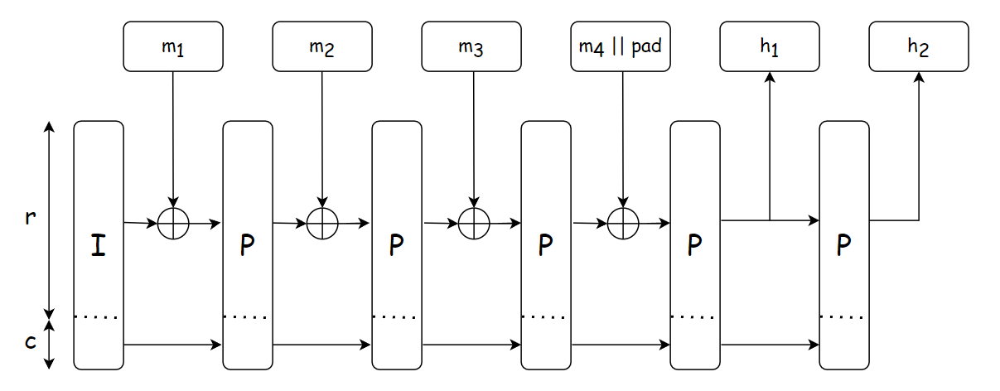

# Poseidon Hash Overview

Now that we understood the architecture of a sponge-based hash function, we are now ready to go to the details of \\(\mathsf{Poseidon}\\). \\(\mathsf{Poseidon}\\) is the proposed hash function in the paper, which maps strings over \\(\mathbb{F}_p\\) (for a prime \\(p \approx 2^n > 2^{31}\\)) to fixed length strings over \\(\mathbb{F}_p\\). Specifically, they define: $$\mathsf{Poseidon}: \mathbb{F}_p^* \longrightarrow \mathbb{F}_p^o,$$ where \\(o\\) is the output length (\\(\mathbb{F}_p\\) elements), usually \\(o = 1\\).

The **overall structure** of \\(\mathsf{Poseidon}\\) hash is described in the figure below.

The hash function is constructed by instantiating a sponge function with the compression function \\(f\\) being the permutation \\(\mathsf{Poseidon}^\pi\\) (denoted by the block labeled \\(\mathsf{P}\\) in the figure). The hashing design strategy is based on \\(\mathsf{Hades}\\) {{#cite GLRRS20}}, which employes different *round functions* throughout the permutation to destroy all of its possible symmetries and structural properties.

The workflow of \\(\mathsf{Poseidon}\\) hash is described below, which is used the same in different use cases:
- Determine the capacity value \\(c\\) and the input padding \\(pad\\) depending on each use cases.
- Split the obtained input \\(m\\) in to chunks of size \\(r\\).
- Apply the \\(\mathsf{Poseidon}^\pi\\) permutation to the capacity element and the first chunk: \\(I_c \oplus m_1\\).
- Add the result to the state and apply the permutation again until no more chunks are left.
- Output \\(o\\) output elements from the bitrate part of the state. If needed, iterate the permutation one more time.

Given that the overall structure of \\(\mathsf{Poseidon}\\) is determined by the instatiation of \\(\mathsf{Poseidon}^\pi\\), in  the next Sections, we would go to the details of each \\(\mathsf{Poseidon}^\pi\\) block (or equavilently, the block labeled \\(\mathsf{P}\\) in the figure).
